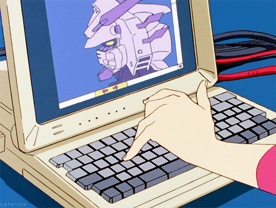
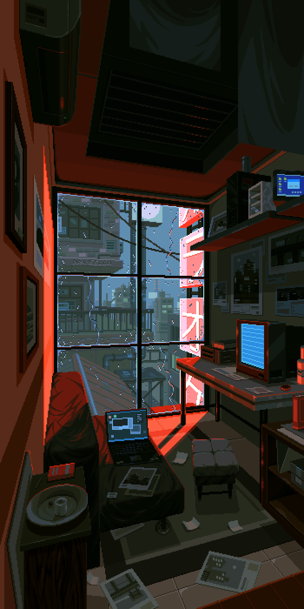

<!-- Heading -->
<h1 align="center">  Hi there! I'm Gabriel Sousa</h1>

<!-- Contact section -->
<h2>Contact me</h2>

    <a href="https://www.linkedin.com/in/gabrieldsousa/">LinkedIn</a> •
    <a href="https://twitter.com/GabsDSousa">Twitter</a> •
    <a href="https://www.instagram.com/GabsDSousa/">Instagram</a>

<!-- Kofi section -->

    

<!-- About section -->
---
<h2>About me</h2>

✨ I'm a full-stack developer with a focus on backend development. I became a full-stack developer because I love studying new trends and languages. When I build a system, if I have the time, I like to understand all the technologies used in the architecture, even if I'm not developing with them, to ensure I'm building a robust, scalable system and using best development practices.

You can find me geeking out about 3D printing or roleplaying games when I'm not coding. Both my work and my hobbies follow the same idea, so I can say that I enjoy building things like websites, systems, gadgets, stories, and characters.

Explore my professional journey on my <a href="https://gabrieldsousa.glitch.me">personal resume website</a> built with React, showcasing a clean and responsive design. It incorporates various best practices, including reactivity, accessibility, and integration with external tools like Glitch.com. The website provides an interactive and visually way to present a professional resume.

<ul>
    <li>&nbsp;&nbsp;&nbsp;&nbsp;💬 Ask me about: Laravel, PHP, 3D printing, Animes</li>
    <li>&nbsp;&nbsp;&nbsp;&nbsp;📫 How to reach me: <a href="https://www.linkedin.com/in/gabrieldsousa/">@GabrielDSousa</a></li>
    <li>&nbsp;&nbsp;&nbsp;&nbsp;⚡ Fun fact: Almost all of my knowledge of the English language came through video games, Gundam anime subtitled in English, television series, and basic English classes at a Brazilian school. Despite the unorthodox methods, I have been certified several times in advanced English.</li>
</ul>
<!-- About section: END -->

<!-- Career section -->
---
<h2>About my career</h2>
<h3>Languages and experience</h3>

<table>
    <tr>
        <th>PHP</th>
        <th>Laravel</th>
        <th>Symfony</th>
        <th>JavaScript</th>
        <th>Vue</th>
        <th>MySQL</th>
        <th>HTML</th>
        <th>CSS</th>
        <th>Git</th>
    </tr>
    <tr>
        <td>5 years</td>
        <td>5 years</td>
        <td>2 months</td>
        <td>5 years</td>
        <td>4 years</td>
        <td>5 years</td>
        <td>5 years</td>
        <td>5 years</td>
        <td>5 years</td>
    </tr>
</table>

<h3>Acknowledgements</h3>

<ul>
    <li>Technical:</li>
</ul>
<table>
    <tr>
        <td>SOLID</td>
        <td>MVC</td>
        <td>Microservices</td>
        <td>REST API</td>
        <td>PHPUnit</td>
        <td>Unit tests</td>
        <td>Docker</td>
        <td>Linux</td>
    </tr>
</table>
<ul>
    <li>Good practices:</li>
</ul>
<table>
    <tr>
        <td>Documentation</td>
        <td>Clean Architecture</td>
        <td>Version control</td>
        <td>Object Orientation</td>
        <td>TDD</td>
    </tr>
</table>
    <ul>
        <li>Tools:</li>
    </ul>
<table>
    <tr>
        <td>Postman</td>
        <td>PhpStorm</td>
        <td>Visual Studio Code</td>
        <td>DBeaver</td>
        <td>GitLab</td>
        <td>GitHub</td>
        <td>Jira</td>
    </tr>
</table>
    <ul>
        <li>Management:</li>
    </ul>
<table>
    <tr>
        <td>Kanban</td>
        <td>OKR</td>
        <td>Agile</td>
        <td>Scrum</td>
    </tr>
</table>

<!-- GitHub section -->
---

<!-- GitHub section: END -->

<!-- THE END -->
