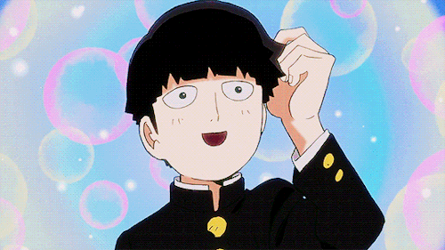

<!-- Heading -->
<h1 align="center">  Hi there! I'm Gabriel Sousa</h1>

<h2> Contact me </h2>

    <a href="https://www.linkedin.com/in/gabrieldsousa/">Linkedin</a> •
    <a href="https://twitter.com/GabsDSousa">Twitter</a> •
    <a href="https://www.instagram.com/GabsDSousa/">Instagram</a>

 <!-- About section -->

---
<h2> About me </h2>

✨ I'm a full stack developer with a focus on backend development. I love studying new trends or new languages, that's why I became a full stack developer. When I build a system, if I have the time, I like to know all the technologies used in the architecture, even if I'm not developing with them, just to make sure I'm building a system that's robust, scalable, and using best development practices.

When I'm not coding, you can find me geeking about 3D printing or roleplaying games. Both my work and my hobbies have the same idea, so I can say that I like to build things, like websites, systems, gadgets, stories, characters.

---

<ul align="left">
    <li>😄 My Pronouns: He/His </li>
    <li>💬 Ask me about: Laravel, PHP, Building Career In Tech, Animes</li>
    <li>📫 How to reach me: <a href="https://www.linkedin.com/in/gabrieldsousa/">@GabrielDSousa</a></li>
    <li>⚡ Fun fact: Almost all of my knowledge of the English language came through video games, Gundam anime subtitled in English, television series and basic English classes at Brazilian school. Despite the unorthodox methods I was able to be certified several times with advanced English. </li>
</ul>
<!-- About section: END -->

---
<!-- GitHub section -->
<h3> My GitHub Stats  </h3>
 

  
  

    
    

<!-- GitHub section: END -->

<!-- THE END -->
